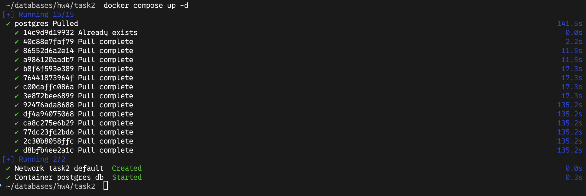
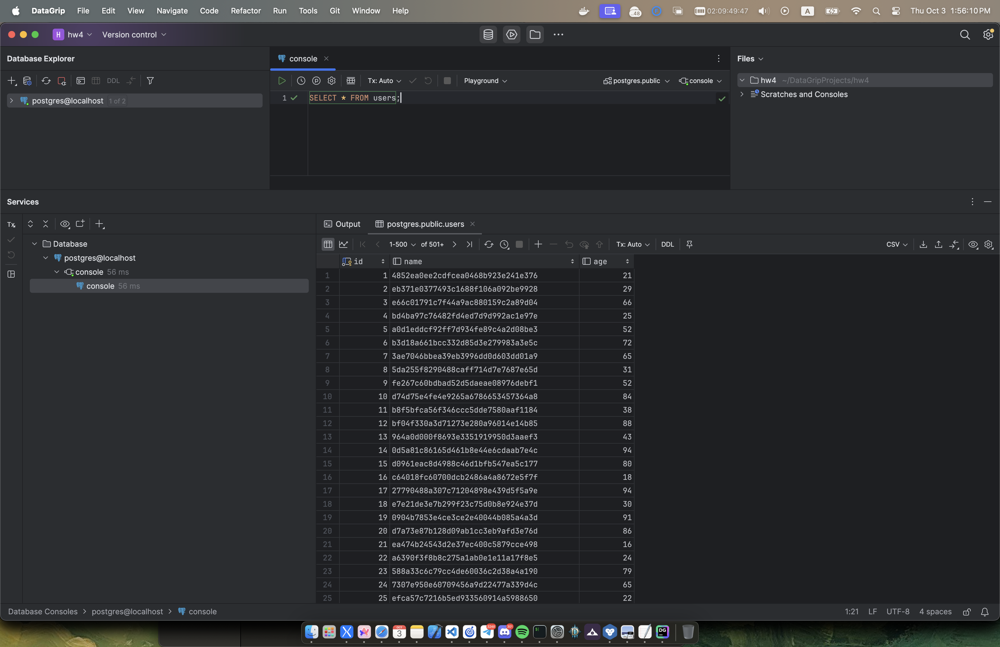
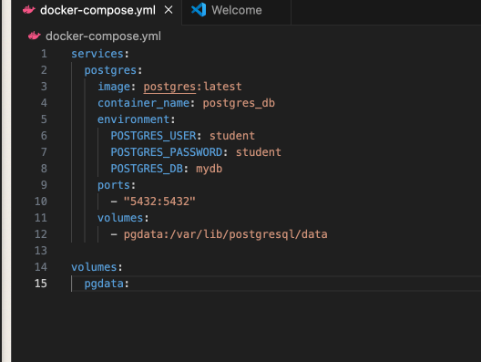
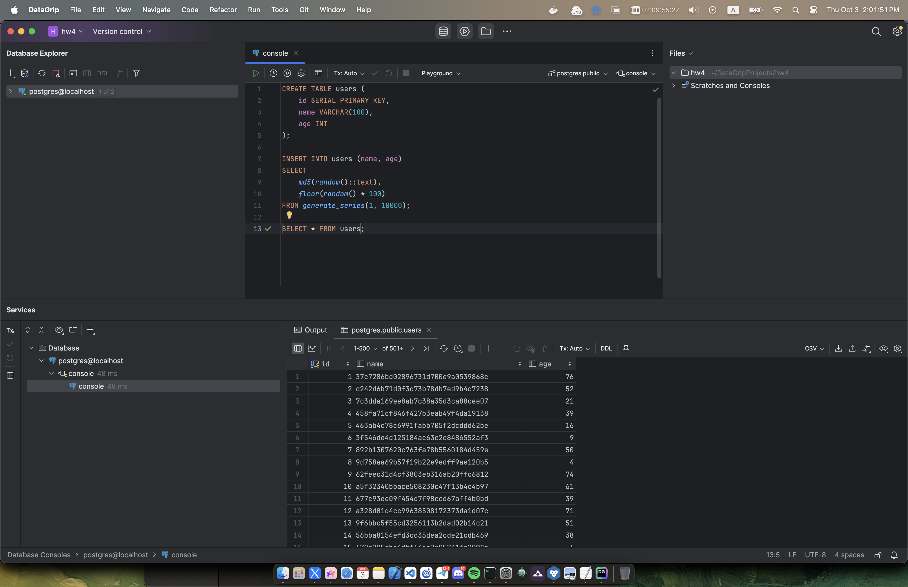
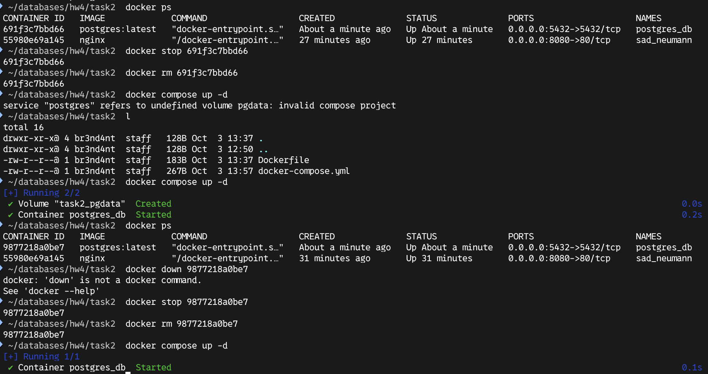
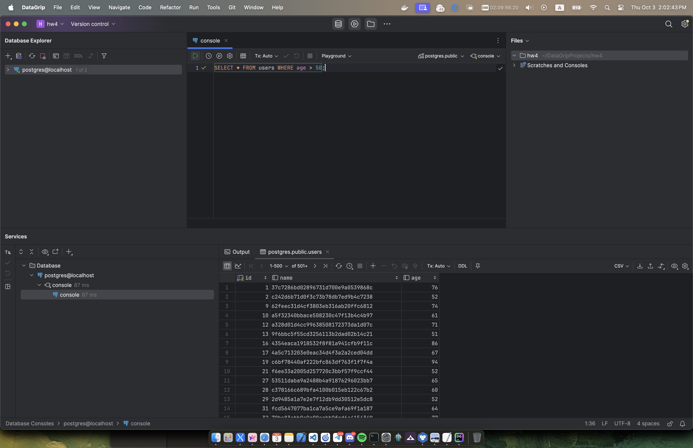

### Проект собирается с таким compose:
```yml
services:
  postgres:
    image: postgres:latest
    container_name: postgres_db
    environment:
      POSTGRES_USER: student
      POSTGRES_PASSWORD: student
      POSTGRES_DB: mydb
    ports:
      - "5432:5432"
```

### После чего заполянется рандомными данными.

### Но после удаления контейнеров и повторного подключения к базе данных, появляется ошибка о том что таблица *users* не найдена [скрин забыл сделать :( ]. И это очень даже $make\;sense$, потому что мы не прописывали никакие *Volume*.

### Если же это изменить и прописать заветные *Volume*, и запустить такой же контейнер

### Заполнить его всеми нужными рандомными данными 

###  После чего удалить отключить и удалить контейнер и заново его запустить

### То, чудо, все данные остались

